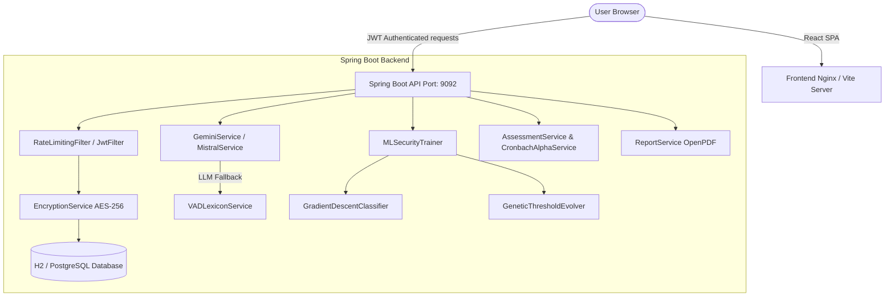

# 🌈 Mood-Based Journal — AI-Powered Emotional Self-Care

[](file:///C:/Users/Savyasachi%20Mishra/Desktop/Mood%20based%20journal/moodjournal/moodjournal/frontend)
[](file:///C:/Users/Savyasachi%20Mishra/Desktop/Mood%20based%20journal/moodjournal/moodjournal/backend)
[](file:///C:/Users/Savyasachi%20Mishra/Desktop/Mood%20based%20journal/moodjournal/moodjournal/backend/pom.xml)
[](file:///C:/Users/Savyasachi%20Mishra/Desktop/Mood%20based%20journal/moodjournal/moodjournal/docker-compose.yml)
[](file:///C:/Users/Savyasachi%20Mishra/Desktop/Mood%20based%20journal/security_best_practices_report.md)

Welcome to the **Mood-Based Journal** repository. This project is a state-of-the-art, privacy-first, AI-augmented wellness journal designed to analyze user emotion trends, track psychological health metrics over time, suggest mindful habits, and preserve user privacy using secure encryption.

---

## 📖 Table of Contents
1. [Overview & Vision](#-overview--vision)
2. [Key Features](#-key-features)
3. [System Architecture](#-system-architecture)
4. [Technology Stack](#-technology-stack)
5. [Repository Structure](#-repository-structure)
6. [Getting Started & Local Setup](#-getting-started--local-setup)
7. [Deployment Flow](#-deployment-flow)
8. [Security Posture & Red-Teaming](#-security-posture--red-teaming)
9. [API Documentation & Health Checks](#-api-documentation--health-checks)

---

## 🧠 Overview & Vision
The **Mood-Based Journal** is built to bridge the gap between AI emotion mapping and psychological self-reflection. Users can log their daily thoughts, track stress and sleep levels, engage in deep, open-ended clinical assessments, and visualize their mental landscape on a clean dashboard. 

Importantly, this project treats user mental health data with extreme caution: it integrates **Zero-Knowledge Style encryption** (AES-256) on the backend to secure journal entries and implements dedicated **Machine Learning Firewalls** to guard against adversarial prompt injections.

---

## ✨ Key Features

### 1. 🤖 AI-Powered Emotion Analysis
- Uses the Google GenAI SDK through [GeminiService](file:///C:/Users/Savyasachi%20Mishra/Desktop/Mood%20based%20journal/moodjournal/moodjournal/backend/src/main/java/com/example/moodjournal/service/GeminiService.java) (running models like `gemini-2.0-flash`, `gemini-2.5-flash-lite`, and `gemini-3-flash`) to parse journal entries and breakdown emotions (e.g. anger, sadness, joy, fear, love, surprise) alongside stress level predictions.
- **Lexicon Fallback**: If the Gemini API is rate-limited or offline, the app seamlessly falls back to a local Valence-Arousal-Dominance (VAD) lexicon in [VADLexiconService](file:///C:/Users/Savyasachi%20Mishra/Desktop/Mood%20based%20journal/moodjournal/moodjournal/backend/src/main/java/com/example/moodjournal/service/VADLexiconService.java) using `vad_lexicon.json` to ensure continuous local analysis.

### 2. 🎛️ Self-Adapting Machine Learning Engines
- **Gradient Descent Classifier**: The [GradientDescentClassifier](file:///C:/Users/Savyasachi%20Mishra/Desktop/Mood%20based%20journal/moodjournal/moodjournal/backend/src/main/java/com/example/moodjournal/ml/GradientDescentClassifier.java) is trained locally on security event history and journal patterns.
- **Genetic Evolutionary Optimization**: Uses the [GeneticThresholdEvolver](file:///C:/Users/Savyasachi%20Mishra/Desktop/Mood%20based%20journal/moodjournal/moodjournal/backend/src/main/java/com/example/moodjournal/ml/GeneticThresholdEvolver.java) to run Genetic Algorithms (GA) that evolve decision-making thresholds, adapting emotional baselines to individual users.
- **Risk & Alert Ensemble**: [EnsembleRiskService](file:///C:/Users/Savyasachi%20Mishra/Desktop/Mood%20based%20journal/moodjournal/moodjournal/backend/src/main/java/com/example/moodjournal/service/EnsembleRiskService.java) combines traditional rule-based filters with custom machine learning classifiers to assess psychological risks (e.g., self-harm indicators) and flag immediate crises.

### 3. 📝 Interactive Psychological Assessments
- Supports structured questionnaires: **PHQ-9** (depression tracker), **BFPT** (Big Five Personality Test), **Enneagram**, and **EQ-60** (Emotional Intelligence Test).
- Personalized follow-ups: Integrates a Mistral-based agent ([MistralService](file:///C:/Users/Savyasachi%20Mishra/Desktop/Mood%20based%20journal/moodjournal/moodjournal/backend/src/main/java/com/example/moodjournal/service/MistralService.java)) to generate 10 custom, open-ended psychological questions based on the user's last 5 journal entries.
- Evaluates test reliability dynamically using internal consistency analysis in [CronbachAlphaService](file:///C:/Users/Savyasachi%20Mishra/Desktop/Mood%20based%20journal/moodjournal/moodjournal/backend/src/main/java/com/example/moodjournal/service/CronbachAlphaService.java).
- Fully implemented on the frontend in the [DeepAssessment.jsx](file:///C:/Users/Savyasachi%20Mishra/Desktop/Mood%20based%20journal/moodjournal/moodjournal/frontend/src/pages/DeepAssessment.jsx) page.

### 4. 🔒 Built-In Security Shielding
- **Zero-Knowledge Encryption**: Journal content is encrypted transparently on save and decrypted on load by [EncryptionService](file:///C:/Users/Savyasachi%20Mishra/Desktop/Mood%20based%20journal/moodjournal/moodjournal/backend/src/main/java/com/example/moodjournal/security/crypto/EncryptionService.java) using AES-256 (BouncyCastle), securing user entries.
- **Prompt Injection Protection**: The [AISecurityService](file:///C:/Users/Savyasachi%20Mishra/Desktop/Mood%20based%20journal/moodjournal/moodjournal/backend/src/main/java/com/example/moodjournal/service/AISecurityService.java) executes strict validation, shielding AI templates from jailbreaks and prompt attacks.
- **Anti-Abuse Controls**: Utilizes [RateLimitingFilter](file:///C:/Users/Savyasachi%20Mishra/Desktop/Mood%20based%20journal/moodjournal/moodjournal/backend/src/main/java/com/example/moodjournal/config/RateLimitingFilter.java) (via Bucket4j) for request throttling, and implements JWT fingerprint validation to mitigate session-hijacking.

### 5. 🖨️ Exportable Reports & Analytics
- Users can export their journal logs, assessment trends, and mood summaries directly to a PDF via [ReportService](file:///C:/Users/Savyasachi%20Mishra/Desktop/Mood%20based%20journal/moodjournal/moodjournal/backend/src/main/java/com/example/moodjournal/service/ReportService.java) (using OpenPDF), enabling sharing with therapists.
- Comprehensive charts and progress maps are rendered natively on the frontend in [Analytics.jsx](file:///C:/Users/Savyasachi%20Mishra/Desktop/Mood%20based%20journal/moodjournal/moodjournal/frontend/src/pages/Analytics.jsx) using Chart.js.

---

## 🏗️ System Architecture



---

## 🛠️ Technology Stack

| Layer | Technology | Primary Role |
|---|---|---|
| **Frontend** | React 18, Vite, TailwindCSS | Single Page Application, dynamic theming |
| **Frontend Utilities** | Chart.js, Framer Motion, Axios | Visual analytics, smooth micro-animations, network requests |
| **Backend Framework** | Spring Boot 3.5, Java 21 | Web MVC API, task scheduling, asynchronous executors |
| **AI Integration** | Google GenAI SDK, Spring AI | Emotion breakdowns, natural language processing |
| **Local ML & Stats** | Java Native Matrix math, Genetic Algorithms | Threshold adaptation, gradient descent classifications, Cronbach reliability |
| **Database** | H2 (Dev / Spaces), PostgreSQL (Prod) | Structured persistence, schema auto-migration |
| **Security & Crypto** | Spring Security, BouncyCastle | AES-256 entry encryption, JWT rotation + fingerprint check |
| **Rate Throttling** | Bucket4j | Endpoint protection & API rate compliance |
| **PDF Rendering** | OpenPDF (LibrePDF) | Exporting entries to PDF |
| **Deployment** | Docker & Compose, Nginx | Multi-container isolation, deployment configs |

---

## 📂 Repository Structure

Below is the simplified structure of the repository. Check individual folders for localized settings:

```
Mood based journal/                     # Workspace Git Root
├── py_isear_dataset/                   # Machine learning data tools
│   ├── py_isear/                       # Python loader modules
│   │   ├── enums.py                    # ISEAR dataset enums
│   │   └── isear_loader.py             # Parses ISEAR csv files
│   ├── isear.csv                       # ISEAR raw emotional text dataset
│   ├── main.py                         # Example execution script
│   └── README.md                       # Python loader docs
│
├── moodjournal/                        # Primary project folder
│   ├── package.json                    # Workspace testing runner config
│   └── moodjournal/                    # Main application folder
│       ├── DEPLOYMENT.md               # Detailed Docker/deploy guidelines
│       ├── docker-compose.yml          # Dev database & services configuration
│       ├── frontend/                   # React + Vite application
│       │   ├── src/                    # Source folder (components & pages)
│       │   ├── package.json            # React deps & scripts
│       │   └── vite.config.js          # Vite proxy definitions
│       │
│       └── backend/                    # Java REST API source
│           ├── pom.xml                 # Maven build descriptors & Spring dependencies
│           ├── Dockerfile              # Native GraalVM runtime compiler config
│           └── src/main/               # Spring Boot sources
│               ├── java/com/example/...
│               │   ├── config/         # Security configs, filters & CORS
│               │   ├── controller/     # REST Endpoints
│               │   ├── ml/             # Local Gradient Descent & GA engines
│               │   ├── model/          # Entities (JournalEntry, User, Alert, etc.)
│               │   └── service/        # Core business operations (Gemini, VAD, etc.)
│               └── resources/
│                   ├── application.properties  # Service credentials & fallback variables
│                   └── vad_lexicon.json        # Valence-Arousal-Dominance lexicon data
│
├── migrate_secrets.py                  # Secrets exporter script (Render -> HF Spaces)
├── hf_upload.py                        # Hugging Face deployment pipeline automation
├── security_best_practices_report.md   # System audit report
└── security_note_2026-02-15_prompt_injection.md  # Red-team prompt injection assessment
```

---

## ⚙️ Getting Started & Local Setup

For detailed steps on production configurations, please consult the [DEPLOYMENT.md](file:///C:/Users/Savyasachi%20Mishra/Desktop/Mood%20based%20journal/moodjournal/moodjournal/DEPLOYMENT.md).

### Prerequisites
- **Java 21 JDK** (e.g. GraalVM or OpenJDK)
- **Node.js** (v18+)
- **Maven** (packaged `mvnw` wrapper is included in backend)
- **Docker** (Optional, for launching postgres databases locally)

---

### Step-by-Step Installation

#### 1. Setup Environment
Go into the main application directory, clone the env template, and configure your secrets:
```bash
cd moodjournal/moodjournal
cp .env.example .env
```
Open `.env` and fill out your keys:
- `GOOGLE_API_KEY`: Obtain this from [Google AI Studio](https://aistudio.google.com/).
- `JWT_SECRET`: Generate a secure secret using `openssl rand -hex 32`.
- `RESEND_API_KEY`: Used for sending email resets (via [Resend](https://resend.com/)).

#### 2. Start the Backend
Navigate to the backend directory and launch using Maven wrapper:
```bash
cd backend
# Windows Command Prompt / PowerShell:
mvnw.cmd spring-boot:run

# Linux / MacOS:
./mvnw spring-boot:run
```
The server will boot on port `9092` by default.

#### 3. Start the Frontend
Open a new terminal window, navigate to the frontend directory, install dependencies, and launch Vite dev server:
```bash
cd moodjournal/moodjournal/frontend
npm install
npm run dev
```
Open your browser at `http://localhost:5173`. Any API calls to `/api` will be proxied automatically to `http://localhost:9092`.

#### 4. Running via Docker Compose
To build and run all services (PostgreSQL, Spring Boot backend, and Nginx frontend proxy) in containers:
```bash
cd moodjournal/moodjournal
docker-compose up -d --build
```
Access the application at `http://localhost` (Frontend on port 80).

---

## 🚀 Deployment Flow

The repository comes with automation to deploy the backend and frontend to Hugging Face Spaces:

1. **Secrets Migration**: Run [migrate_secrets.py](file:///C:/Users/Savyasachi%20Mishra/Desktop/Mood%20based%20journal/migrate_secrets.py) to read local Render parameters and upload them to Hugging Face Space secrets:
   ```bash
   python migrate_secrets.py
   ```
2. **Space Deployment**: Run [hf_upload.py](file:///C:/Users/Savyasachi%20Mishra/Desktop/Mood%20based%20journal/hf_upload.py) to build appropriate deployment templates and push code to your Spaces:
   ```bash
   python hf_upload.py
   ```

*Note: Backend compiles into a GraalVM native binary on HF Spaces, which can take 10-20 minutes. Subsequent startups are near-instantaneous.*

---

## 🛡️ Security Posture & Red-Teaming

Mental health journals contain highly sensitive user inputs. To secure this project, standard verification practices have been conducted:
- **Security Audit**: Details regarding identified vulnerabilities, authorization improvements, rate-limiting spoofing, and database safety can be reviewed in [security_best_practices_report.md](file:///C:/Users/Savyasachi%20Mishra/Desktop/Mood%20based%20journal/security_best_practices_report.md).
- **Prompt Injection Red-Teaming**: Extensive prompt injection scenario simulations were run. You can view the scenario statuses, failures, and mitigations in [security_note_2026-02-15_prompt_injection.md](file:///C:/Users/Savyasachi%20Mishra/Desktop/Mood%20based%20journal/security_note_2026-02-15_prompt_injection.md).

Defenses continue to evolve automatically using the local model trainers on scheduled intervals.

---

## 🏥 API Documentation & Health Checks

Once the backend is up and running, you can access the following utility endpoints:

| Endpoint | Description |
|---|---|
| `http://localhost:9092/swagger-ui.html` | Swagger UI OpenAPI documentation |
| `http://localhost:9092/v3/api-docs` | OpenAPI JSON specs |
| `http://localhost:9092/actuator/health` | Service health status |
| `http://localhost:9092/actuator/info` | Application configuration information |
